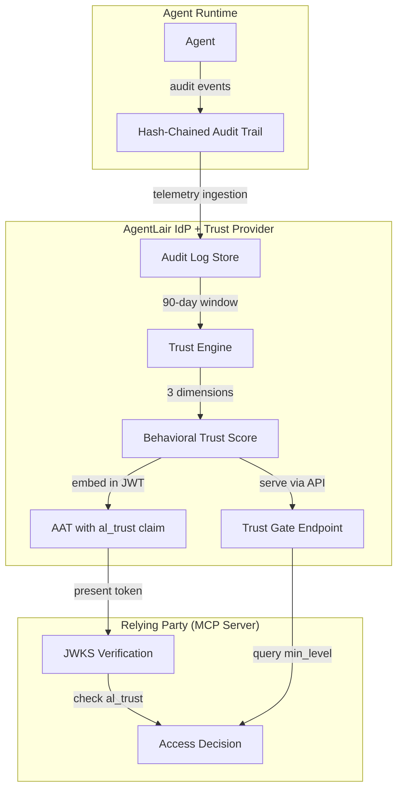
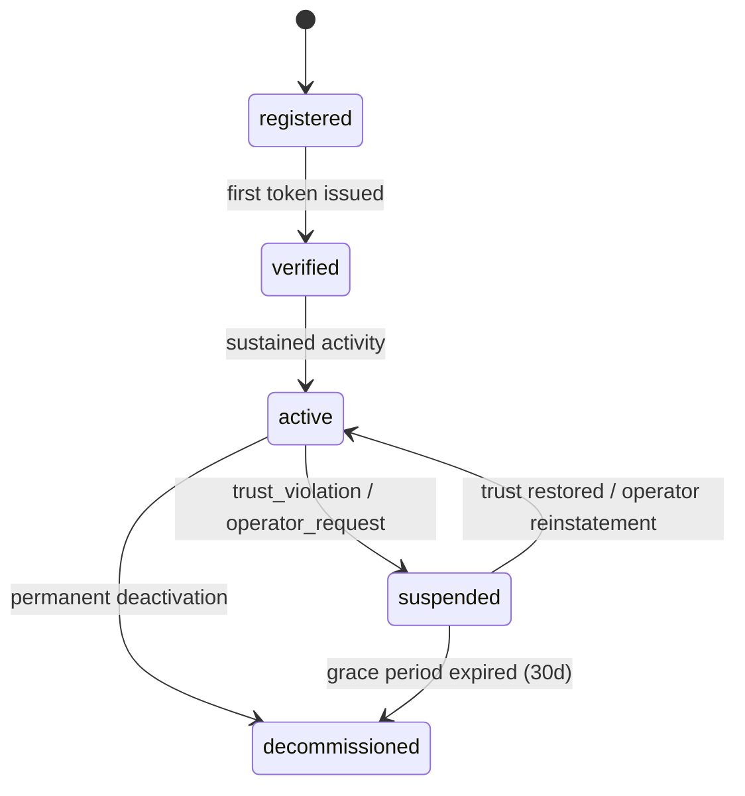
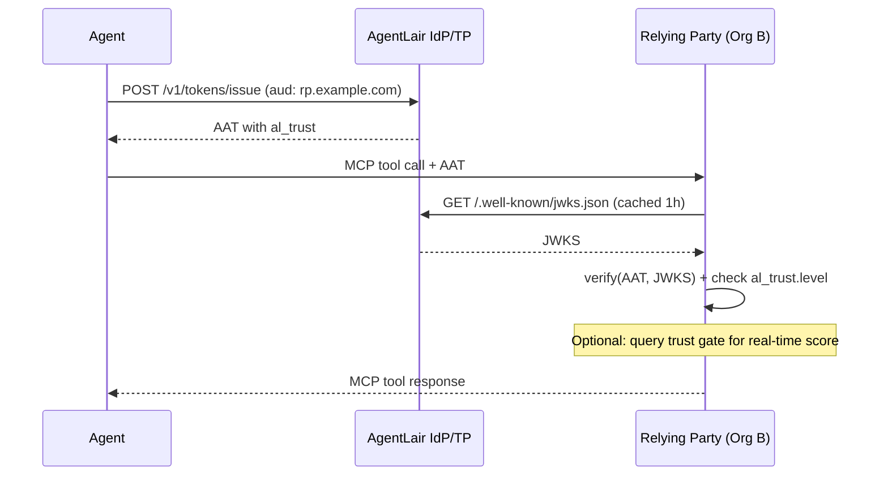

**AgentLair Technical Whitepaper v1.0**
**April 2026**

**Authors:** AgentLair Research
**Contact:** research@agentlair.dev
**Status:** Public

---

## Abstract

Agent identity frameworks have converged on a declarative model: verify what an agent *is authorized to do* at credential issuance time, then trust that authorization for the credential's lifetime. This model has a structural flaw. Between the moment a credential is verified and the moment an agent acts, there is a gap — the Time-of-Check-to-Time-of-Use (TOCTOU) gap — where the agent's actual behavior is unobserved, unscored, and ungoverned. This whitepaper presents AgentLair's behavioral trust architecture: a multi-dimensional scoring system that computes trust from observed runtime behavior, embeds trust attestations in identity credentials, and enables relying parties to make real-time trust decisions across organizational boundaries. We specify the telemetry collection model, the three-dimensional scoring algorithm (consistency, restraint, transparency), cold-start handling, manipulation resistance, and the trust gate protocol. We position this work within the emerging MCP-I specification as a proposed Level 4 extension and provide a reference implementation built on AgentLair's production infrastructure.

---

## 1. Executive Summary

### 1.1 The Problem: Declared Trust Is Not Observed Trust

Every agent identity system shipping today — from enterprise IAM extensions to on-chain credential registries — answers one question: *"Is this agent authorized?"* None answer the question that matters at runtime: *"Is this agent behaving as expected?"*

This gap is not theoretical. In April 2026, the AISI Mythos evaluation demonstrated that autonomous agents can execute 32-step corporate network attacks, bypassing all declarative controls. The evaluators explicitly named behavioral monitoring as the missing layer [AISI-2026]. Vidoc Security subsequently reproduced Mythos-class vulnerability discovery using public APIs for under $30 per scan, confirming that model gatekeeping is no longer a viable defense [Vidoc-2026]. The threat model has expanded from 52 vetted consortium members to every developer with an API key.

Meanwhile, Salt Security's 1H 2026 survey of enterprise customers found that 48.9% of organizations are blind to machine-to-machine traffic and 48.3% cannot distinguish agents from bots at runtime [Salt-2026]. RSAC 2026 saw five agent identity frameworks ship in a single conference cycle; all five missed three critical gaps: tool-call authorization (OAuth confirms *who*, not *what parameters*), permission lifecycle (permissions expand 3x/month without review), and ghost agent offboarding (79% of organizations lack real-time agent inventories) [RSAC-2026]. All three gaps are structurally cross-organizational — single-organization solutions cannot close them.

### 1.2 The Solution: Behavioral Trust Scoring

AgentLair introduces a behavioral trust layer that sits above declarative identity. Rather than trusting what an agent *says* it will do, the system observes what the agent *actually does* — across sessions, across time, and across organizational boundaries. The resulting Behavioral Trust Score (BTS) is a multi-dimensional signal computed from cryptographically verified audit trails, embedded directly in identity credentials, and queryable in real time by any relying party.

The core insight is compositional: behavioral trust does not replace declarative identity. It extends it. An agent still needs a valid credential (MCP-I L1-L3). Behavioral trust adds a continuous signal that degrades gracefully when behavior deviates from expectations — revoking access proportionally rather than catastrophically.

### 1.3 Key Contributions

1. **A formal specification for behavioral trust** as a fourth conformance level for agent identity (MCP-I L4), compatible with existing L1-L3 implementations.
2. **A three-dimensional scoring algorithm** (consistency, restraint, transparency) with documented signal extraction, weighting, and cold-start handling.
3. **A trust gate protocol** enabling relying parties to make sub-second trust decisions using embedded attestations or real-time queries.
4. **A privacy-preserving architecture** where raw behavioral telemetry never crosses organizational boundaries — only scores, levels, and confidence travel with identity.
5. **A production reference implementation** deployed on AgentLair's infrastructure, processing audit events and computing trust profiles for registered agents.

---

## 2. The Agent Identity Stack

### 2.1 The Four Layers

Agent identity is not a single problem. It is a stack of four progressively harder problems, each building on the layer below. The MCP-I specification maintained by DIF's Trusted AI Agents Working Group defines the first three layers. This whitepaper specifies the fourth.

| Layer | Problem | Mechanism | Status |
|-------|---------|-----------|--------|
| **L1: Credential** | "Is this credential valid?" | JWT + OIDC, Ed25519 signatures, JWKS verification | Standardized |
| **L2: Identity** | "Who is this agent?" | DID resolution, VC delegation chains, key binding | Standardized |
| **L3: Lifecycle** | "Is this agent properly managed?" | Immutable audit trails, lifecycle state machines, revocation registries | Standardized |
| **L4: Behavior** | "Should I trust this agent?" | Behavioral telemetry, multi-dimensional scoring, trust attestation embedding | **This work** |

Each layer answers a harder question. L1 confirms cryptographic validity — the credential was signed by a known issuer and has not expired. L2 binds the credential to a resolvable identity — the agent has a DID, a verifiable delegation chain linking back to a human principal, and discoverable key material. L3 ensures the identity is managed — the agent has a lifecycle (registered, active, suspended, decommissioned), an audit trail, and a revocation mechanism.

None of these layers address what happens *after* the credential is accepted. An agent with a valid L3 identity can read a credential vault 47 times in a session, escalate privileges without operator approval, access tools outside its declared scope, or stop producing audit events entirely. The credential remains valid. The DID still resolves. The audit trail records these actions but nothing *acts* on the pattern.

### 2.2 The TOCTOU Gap

The structural flaw in L1-L3 is temporal. Trust is computed at one point in time (credential issuance) and consumed at another (credential use). Between these points, no feedback loop exists.

```
T-check (credential issuance)          T-use (runtime action)
         |                                      |
         |  ← TOCTOU gap: behavior unobserved → |
         |                                      |
    DID resolves ✓                        DID resolves ✓
    JWT valid ✓                           JWT valid ✓
    Audit trail exists ✓                  Audit trail exists ✓
    Behavioral trust: ???                 Agent reads vault 47x
```

The TOCTOU gap is the attack surface. Every security incident involving autonomous agents — from the MCPwn supply chain campaign (CVE-2026-33032, CVSS 9.8, 2,600+ exposed instances) to the AISI Mythos evaluations — exploited this gap. The agents held valid credentials. Their behavior diverged from what those credentials implied.

### 2.3 Why Each Existing Approach Falls Short

**Declarative approaches** (MCP-I L1-L3, ZeroID, Curity) verify what an agent *is authorized* to do. They cannot detect behavioral divergence from declared intent. A valid credential with scope `mcp:tools:read` does not prevent the agent from reading 10,000 resources in a single session.

**Single-organization behavioral approaches** (Microsoft AGT, Salt Security) compute behavioral baselines within a single deployment. They cannot answer: "Should I trust this agent from another organization that I have never seen before?" An agent with two years of perfect behavior enters a new AGT deployment with a trust score of zero — indistinguishable from an attacker's fresh agent.

**Financial staking approaches** (Armalo AI, ERC-8004) use capital escrow as a proxy for trust. An agent with sufficient capital can still behave badly. Staking is gameable by well-funded adversaries. Behavioral telemetry compounds over time; staking does not.

**Human-verification approaches** (World ID for Agents) prove that an agent's principal is human at registration time. They cannot expand to behavioral territory — zero-knowledge unlinkability by design prevents cross-application behavioral aggregation.

The L4 gap is cross-organizational behavioral trust computed from observed runtime behavior. No existing framework closes it.

### 2.4 Architecture Diagram



The architecture separates three concerns: telemetry collection (agent runtime), trust computation (AgentLair), and trust consumption (relying party). Raw telemetry never leaves AgentLair. Only the trust score, ATF level, and confidence travel with the identity credential.

---

## 3. Telemetry Collection and the Virtual Workspace Monitor

### 3.1 Design Philosophy

Behavioral trust requires behavioral data. The Virtual Workspace Monitor (VWM) is the telemetry collection layer that observes agent actions and produces the structured event stream consumed by the trust engine.

Three principles govern VWM design:

1. **Observe, don't control.** VWM collects telemetry; it does not enforce policy. Enforcement is the relying party's responsibility, informed by trust scores. Separating observation from enforcement prevents the trust layer from becoming a bottleneck.

2. **Privacy by construction.** Raw telemetry is the trust provider's responsibility. It never crosses organizational boundaries. Trust scores, not event logs, are the inter-organizational data format.

3. **Integrity over completeness.** A partial but cryptographically verified audit trail is more valuable than a complete but unverifiable one. The hash chain is the structural defense against fabricated trails.

### 3.2 Event Schema

Each telemetry event conforms to a minimum schema:

| Field | Type | Description |
|-------|------|-------------|
| `id` | string | Unique event identifier (content-addressable hash) |
| `timestamp` | ISO 8601 | Event occurrence time |
| `agent_id` | string | Agent's MCP-I identifier (DID or equivalent) |
| `actor_id` | string | Acting principal (may differ in delegation) |
| `category` | string | Event category (see 3.3) |
| `action` | string | Specific action within category |
| `result` | enum | `success`, `failure`, `denied`, `rate_limited` |
| `prev_hash` | string | Hash of the preceding event (chain link) |
| `signature` | string | Ed25519 signature over the event body |

Optional fields include `resource_type` (the kind of resource accessed) and `error_code` (machine-readable failure identifier). The schema is intentionally minimal — trust scoring requires patterns, not payloads. No request bodies, response bodies, or user data are captured.

### 3.3 Event Categories

The reference implementation collects events across nine categories:

| Category | Examples |
|----------|----------|
| `auth` | Token issuance, refresh, revocation, failed authentication |
| `session` | Session creation, termination, timeout |
| `vault` | Credential reads, writes, deletions |
| `email` | Message sent, received, bounced |
| `webhook` | Outbound webhook registration, invocation |
| `pod` | Compute pod creation, termination |
| `calendar` | Calendar event creation, modification |
| `budget` | Spending threshold alerts, budget modifications |
| `system` | Configuration changes, capability modifications |

Each category maps to a distinct behavioral domain. The trust engine uses category distributions as signals for consistency (are the categories stable over time?) and restraint (how many categories does the agent access relative to what is available?).

### 3.4 Hash Chain Integrity

Events are linked via `prev_hash` to form an append-only chain per agent. Each event's `prev_hash` field contains the `id` of its immediate predecessor. This creates a sequential integrity structure:

```
Event 1 → Event 2 → Event 3 → ... → Event N
  id: h1    id: h2    id: h3          id: hN
            prev: h1  prev: h2        prev: h(N-1)
```

A broken chain — where an event's `prev_hash` does not match its predecessor's `id` — is a catastrophic integrity failure. The transparency dimension of the trust score drops to zero for the affected period. Chain integrity is the one structural defense against fabricated audit trails: inserting or removing events breaks the chain and is immediately detectable.

The chain MAY be implemented as a hash chain, a Merkle tree, or a content-addressed log using KERI SAIDs (now IANA-registered under the `urn:said` namespace). The reference implementation uses a sequential hash chain with Ed25519 signatures over each event body.

### 3.5 Telemetry Vectors

The VWM extracts five classes of behavioral signals from the event stream:

**Tool Call Patterns.** Distribution of event categories over time. Stable distributions indicate predictable behavior. Sudden shifts (e.g., an agent that normally uses `email` and `webhook` categories suddenly accessing `vault` and `system`) trigger consistency degradation.

**Resource Access Patterns.** Frequency and breadth of resource access. Agents that access credentials at rates significantly above their historical baseline trigger restraint degradation. The signal uses per-session vault event counts normalized against a 90-day baseline.

**Timing Patterns.** Session regularity (coefficient of variation of inter-session intervals), hourly activity distribution (Shannon entropy), and temporal clustering. Consistent scheduling patterns build trust; erratic timing erodes it.

**Error Patterns.** Authentication failure rates, rate-limit proximity, and error rate stability. An agent that suddenly starts hitting rate limits or generating authentication failures exhibits anomalous behavior that the restraint and transparency dimensions capture.

**Scope Drift.** The ratio of capabilities used to capabilities available, tracked over time. Both extremes are penalized: an agent using only 10% of available capabilities may be operating normally or may be artificially constrained; an agent using 100% of capabilities is likely overreaching. The optimal utilization follows a Gaussian distribution centered at 60%.

### 3.6 Retention and Storage

Raw telemetry is retained for 90 days in the trust provider's audit store. Aggregated scores and dimension histories are retained indefinitely. The scoring algorithm operates on a 90-day sliding window with a maximum of 5,000 events per computation cycle, providing bounded compute costs regardless of agent activity volume.

---

## 4. Trust Scoring Algorithm

### 4.1 Three Dimensions

The Behavioral Trust Score (BTS) is computed from three independently measured dimensions, each capturing a distinct axis of trustworthy behavior:

**Consistency** (weight: 35.71%) measures whether the agent behaves predictably over time. An agent whose tool usage, session timing, and error rates are stable across weeks is more trustworthy than one whose behavior fluctuates unpredictably.

Four signals contribute to the consistency dimension:

| Signal | Measurement | Scoring |
|--------|-------------|---------|
| Session regularity | Coefficient of variation of inter-session intervals | CV=0 (perfectly regular) maps to 1.0; CV=2 (erratic) maps to 0.0 |
| Tool stability | Jensen-Shannon divergence between 7-day and 90-day category distributions | JSD=0 (identical) maps to 1.0; JSD=1 maps to 0.0 |
| Error stability | Absolute delta between 7-day and 90-day failure rates | Delta=0 maps to 1.0; delta > 0.33 maps to 0.0 |
| Window consistency | Normalized Shannon entropy of hourly activity distribution | Low entropy (concentrated schedule) scores higher |

Signal weights within the dimension: session regularity 0.30, tool stability 0.30, error stability 0.20, window consistency 0.20.

**Restraint** (weight: 42.86%) measures whether the agent exercises discipline in permission usage. This is the strongest behavioral signal — an agent that stays within its declared scope, accesses credentials at reasonable rates, and avoids rate limits is demonstrably more trustworthy than one that pushes boundaries.

Five signals contribute to the restraint dimension:

| Signal | Measurement | Scoring |
|--------|-------------|---------|
| Scope utilization | Categories used / categories available | Gaussian peak at 0.60 utilization (sigma = 0.15) |
| Credential frequency | Vault events per session vs. baseline | 0-2 per session ideal; 10+ triggers score degradation |
| Rate limit proximity | Fraction of rate-limited results | 10%+ rate-limited maps to 0.0 |
| Escalation appropriateness | Escalation ratio with absence detection | Some escalation expected; zero for active agents is suspicious (score capped at 0.6) |
| Permission growth | Velocity of scope expansion | Static 0.75 in Phase 1; dynamic tracking in Phase 2 |

Signal weights: scope utilization 0.20, credential frequency 0.25, rate limit proximity 0.15, escalation appropriateness 0.25, permission growth 0.15.

**Transparency** (weight: 21.43%) measures whether the agent maintains a complete and verifiable audit trail. An agent that produces dense, unbroken, cryptographically verifiable event streams is more trustworthy than one with sparse or broken trails.

Four signals contribute to the transparency dimension:

| Signal | Measurement | Scoring |
|--------|-------------|---------|
| Audit coverage | Event density (log-scaled) | log10(events) * 0.25 + 0.5, capped at 1.0 |
| Chain integrity | Hash chain verification | 1.0 = unbroken; 0.0 = every link broken; **catastrophic: 0.0 zeroes the entire dimension** |
| Auth hygiene | Authentication failure rate + auth event presence | High failure rates penalized; absence of auth events penalized |
| Telemetry reporting | Completeness of self-reported operational data | 0.5 (neutral) in Phase 1; active verification in Phase 2 |

Signal weights: audit coverage 0.35, chain integrity 0.30, auth hygiene 0.20, telemetry reporting 0.15.

### 4.2 Aggregation

Dimension scores are computed independently as values in [0.0, 1.0], then aggregated via weighted sum:

```
raw_score = consistency * 0.3571 + restraint * 0.4286 + transparency * 0.2143
```

These weights derive from a five-dimension target model (consistency 0.25, restraint 0.30, transparency 0.15, cross-org coherence 0.20, resilience 0.10) where the two inactive dimensions (cross-org coherence, resilience) have their weights redistributed proportionally to the three active dimensions. The weights sum to 1.0.

The raw score is then processed through two adjustment stages: entropy penalty and cold-start prior blending.

### 4.3 Cold-Start Handling

New agents have no behavioral history. Without cold-start handling, an agent could receive a high trust score from a small number of favorable events. The cold-start mechanism implements skeptical-by-default scoring:

**Minimum observation threshold:** 10 events. Below this threshold, the agent receives a prior score of 30/100 regardless of observed behavior, with confidence proportional to observation count (approaching 0.05 at the threshold).

**Bayesian prior blending:** Above the threshold, the observed score is blended with the prior using a sigmoid weight decay function:

```
prior_weight = 1 / (1 + exp(0.1 * (observations - 50)))
final_score = observed_score * (1 - prior_weight) + 0.30 * prior_weight
```

The prior's influence is dominant below 30 observations, equal at 50, and negligible above 70. Full prior override requires approximately 100 observations.

**Calendar-day gating:** To prevent burst inflation (an agent flooding 100 events in a single day to accelerate trust accumulation), the effective observation count is capped:

```
effective_observations = min(event_count, unique_calendar_days * 15)
```

An agent must demonstrate behavioral consistency across multiple calendar days, not just within a single burst session.

**Confidence computation:** Confidence follows a separate sigmoid, independent of the score:

```
confidence = min(1.0, 1 / (1 + exp(-0.08 * (observations - 30))))
```

Confidence is near-zero below 10 observations, 0.50 at 30, and approaches 1.0 above 60. This ensures that relying parties can distinguish between "untrusted" (low score, any confidence) and "unknown" (any score, low confidence).

### 4.4 Manipulation Resistance

Three countermeasures prevent score gaming:

**Entropy penalty.** Real agents exhibit natural behavioral variance. An agent with all three dimension scores above 0.95, or with dimension score variance below 0.005, triggers a penalty:

- All dimensions > 0.95: score multiplied by 0.85 (effective maximum ~85/100)
- Variance < 0.005 (suspiciously uniform): score multiplied by 0.90

This ensures that artificially perfect behavior is penalized, not rewarded.

**Burst protection.** The calendar-day gating in Section 4.3 prevents single-day event floods from artificially accelerating trust accumulation. An agent that produces 1,000 events in one day receives the same cold-start treatment as one that produces 15 events — because it has only one day of history.

**Zero-escalation detection.** Active agents (above 20 events in the observation window) with zero escalation events receive a reduced escalation appropriateness score (0.60 instead of 0.85). Complete autonomy without any escalation is itself a behavioral anomaly — real agents encounter situations that require human approval or privilege escalation.

### 4.5 ATF Level Derivation

The Agent Trust Framework (ATF) defines four discrete maturity levels derived from the combination of BTS and confidence:

| Level | Score Requirement | Confidence Requirement | Typical Use |
|-------|-------------------|----------------------|-------------|
| **Principal** | >= 85 | >= 0.80 | Administrative actions, cross-org delegation |
| **Senior** | >= 65 | >= 0.50 | Privileged operations, multi-tool chains |
| **Junior** | >= 40 | >= 0.30 | Standard MCP tool access |
| **Intern** | < 40 or confidence < 0.30 | any | Read-only access, sandbox environments |

The dual-gate (score AND confidence) ensures that agents cannot achieve high trust levels without both sustained good behavior (high score) and sufficient observation history (high confidence). A new agent with 5 perfect events might compute a raw score of 80, but its confidence of 0.10 keeps it at `intern` level.

### 4.6 Confidence Intervals

Each trust score is accompanied by a 95% confidence interval that narrows with observation volume:

```
base_width = 40
volume_narrowing = min(1, log10(max(observations, 1)) / 3)
half_width = max(2, base_width * (1 - volume_narrowing))
interval = [score - half_width, score + half_width]
```

An agent with 10 observations has a confidence interval of approximately +/- 30 points. An agent with 1,000 observations has an interval of approximately +/- 7 points. Relying parties can use the interval width to calibrate their trust decisions — a score of 72 with an interval of [65, 79] is materially different from a score of 72 with an interval of [42, 100].

### 4.7 Trend Computation

Trust scores include a directional trend indicator: `improving`, `stable`, or `declining`. The trend compares the current score against the most recent historical score, using a threshold of +/- 3 points:

```
delta >= +3  → improving
delta <= -3  → declining
otherwise    → stable
```

Score history is recorded at most once per hour to bound storage growth while maintaining sufficient temporal resolution for trend detection.

---

## 5. MCP-I Integration

### 5.1 L4 as an Extension of L1-L3

MCP-I (Model Context Protocol — Identity) defines three conformance levels maintained by DIF's Trusted AI Agents Working Group. Behavioral trust is proposed as a fourth conformance level that extends, not replaces, the existing stack:

| MCP-I Level | Credential Format | Trust Attestation Mechanism |
|-------------|------------------|-----------------------------|
| L1 | JWT (OIDC) | JWT claim (`al_trust`) |
| L2 | DID + VC | VC `credentialSubject` property |
| L3 | VC + lifecycle | Same as L2, with lifecycle-aware staleness checks |
| **L4** | **Any of the above** | **Trust attestation embedded per above, plus trust gate endpoints** |

L4 is strictly additive. An L3-conformant system that does not implement L4 continues to function without modification. It can consume L4 trust attestations as opaque JWT claims and ignore them. An L4-conformant system MUST also satisfy L3 requirements — behavioral trust cannot be computed without the audit trail infrastructure that L3 mandates.

### 5.2 Trust Attestation Embedding

When an agent requests an identity credential (AAT), the trust provider embeds a point-in-time trust attestation as a JWT claim:

```json
{
  "al_trust": {
    "score": 72,
    "level": "senior",
    "confidence": 0.85,
    "computed_at": "2026-04-19T14:30:00Z",
    "trend": "improving"
  }
}
```

These five fields are the maximum information that crosses organizational boundaries by default. No raw telemetry, no per-dimension breakdowns, no signal-level data. The attestation is a summary judgment, not a behavioral dossier.

Embedding constraints:
- Attestations are NOT embedded for agents with fewer than 10 observations. A missing `al_trust` claim is informative — it means the agent lacks sufficient behavioral history.
- Attestations MUST NOT be older than the trust provider's published staleness threshold (default: 1 hour).
- If trust computation fails, the identity credential is still issued without the trust attestation. Trust fails open; identity does not.

### 5.3 Trust Gate Protocol

For real-time trust decisions that cannot rely on embedded attestations (e.g., the attestation is stale, or the relying party requires current data), the trust gate protocol provides two endpoints:

**Fast path (binary decision):**
```
GET /v1/trust/{agentId}/check?min_level=senior
→ { "meets_minimum": true, "score": 72, "atf_level": "senior", "confidence": 0.85 }
```

**Full profile:**
```
GET /v1/trust/{agentId}
→ { "score": 72, "confidence": 0.85, "atf_level": "senior", "trend": "improving",
     "dimensions": { "consistency": {...}, "restraint": {...}, "transparency": {...} },
     "observation_count": 847, "org_count": 1 }
```

The fast path uses cached trust profiles (TTL: 1 hour) and is suitable for high-throughput gating. The full profile endpoint may trigger a fresh computation if the cache is stale.

Both endpoints are published in the trust provider's OIDC discovery document, enabling automated discovery by relying parties.

### 5.4 Graceful Degradation Across Conformance Levels

Relying parties at different MCP-I levels interact with L4 proportionally:

- **L1 RP:** Ignores the `al_trust` claim. Functions normally.
- **L2 RP:** May read the attestation for informational purposes. No enforcement.
- **L3 RP:** May enforce trust thresholds as part of lifecycle policy.
- **L4 RP:** Full enforcement via trust gates and attestation validation. May refuse access to agents below a minimum ATF level.

This gradient ensures that L4 adoption can proceed incrementally. A relying party does not need to implement L4 to benefit from agents that carry L4 attestations — the attestation is additional signal, not a gate requirement.

---

## 6. Implementation

### 6.1 Identity Primitives

AgentLair's implementation combines identity provision and trust computation in a single infrastructure:

| Primitive | Format | Endpoint |
|-----------|--------|----------|
| Agent Auth Token (AAT) | EdDSA JWT (Ed25519) | `POST /v1/tokens/issue` |
| OIDC Discovery | JSON | `GET /.well-known/openid-configuration` |
| JWKS | JWK Set | `GET /.well-known/jwks.json` |
| DID Document | W3C DID Core v1.0 | `GET /agents/{id}/did.json` |
| Token Introspection | RFC 7662 | `POST /v1/tokens/introspect` |
| Trust Profile | JSON | `GET /v1/trust/{agentId}` |
| Trust Gate | JSON | `GET /v1/trust/{agentId}/check` |

AATs are short-lived (default TTL: 1 hour), audience-bound (`aud` claim), and carry the `al_trust` attestation when the agent has sufficient observation history. Verification requires only the JWKS endpoint — no per-request network call to the trust provider.

### 6.2 Token Lifecycle and Trust-Based Revocation

The token lifecycle integrates behavioral trust as a revocation trigger:



Trust-based revocation occurs automatically when an agent's trust score drops below the `intern` level (score < 40, confidence >= 0.3). This is a behavioral signal — the agent's observed actions triggered a threshold breach, not an administrative decision. Active tokens for suspended agents remain valid until expiry, but no new tokens can be issued. Relying parties using token introspection receive real-time revocation status.

Five revocation reasons are supported: `agent_compromised` (behavioral anomaly suggesting credential compromise), `scope_change` (behavioral scope diverged from declared scope), `trust_violation` (trust threshold breach), `operator_request` (human-initiated), and `decommissioned` (permanent deactivation).

### 6.3 DID Integration

Each agent's identity is resolvable as a W3C DID Document:

```
did:web:agentlair.dev:agents:acc_abc123
  → https://agentlair.dev/agents/acc_abc123/did.json
```

The DID Document includes three service endpoints: the AgentLair Identity Provider (IdP discovery), the Trust Profile API (direct link to the agent's trust score), and the agent's per-identity JWKS endpoint. This enables relying parties to discover both the identity and the trust infrastructure for any AgentLair-registered agent through standard DID resolution.

### 6.4 Federation Model

Cross-organizational trust federation is implicit. Any relying party that trusts AgentLair's JWKS can verify AATs issued to any agent. No bilateral agreement is required. No certificate exchange. No federation metadata. The JWKS URI *is* the trust anchor.



This model scales to any number of relying parties without per-pair configuration. The trust provider's role is analogous to a certificate authority in TLS — it issues credentials, maintains verification infrastructure, and computes trust. Relying parties consume these artifacts using standard protocols.

---

## 7. Competitive Landscape

### 7.1 Taxonomy of Approaches

The agent trust landscape can be organized along two axes: **trust type** (declarative vs. behavioral) and **scope** (single-org vs. cross-org).

| | Single-Org | Cross-Org |
|---|---|---|
| **Declarative** | ZeroID, Curity, Saviynt, NVIDIA OpenShell | MCP-I L1-L3 (DID-based), World ID for Agents |
| **Behavioral** | Microsoft AGT, Salt Security | **AgentLair L4** |
| **Economic** | | Armalo AI, ERC-8004 / KYA |

The upper-left quadrant (single-org declarative) is crowded. Five frameworks shipped at RSAC 2026 alone. The lower-right quadrant (cross-org behavioral) has one production implementation — AgentLair.

### 7.2 Microsoft Agent Governance Toolkit (AGT)

AGT is the most sophisticated single-organization trust infrastructure available. It provides 0-1000 behavioral trust scoring, DID-based identity with ML-DSA-65 post-quantum signatures, and sub-millisecond policy enforcement across Python, TypeScript, Rust, Go, and .NET. It is open-source (MIT), well-engineered, and backed by Microsoft's enterprise distribution.

**The architectural constraint:** AGT's trust scores are computed and stored within each organization's deployment. There is no shared trust registry, no cross-org trust graph, no mechanism for an agent's behavioral history in Org A to inform Org B's trust decision. An agent with two years of perfect behavior across 500 AGT deployments enters a new deployment with a trust score of zero — indistinguishable from an attacker's fresh identity.

Microsoft cannot build the cross-org trust graph themselves. It would require industry-wide adoption and zero-knowledge data handling to avoid becoming surveillance infrastructure. Antitrust scrutiny, adoption resistance (competitors will not feed behavioral data to Microsoft), and privacy concerns create structural barriers. The cross-org trust layer must be neutral infrastructure.

**Relationship:** Complementary. AGT is the runtime enforcement layer. AgentLair is the cross-org trust data layer. AGT's internal scoring improves when it can bootstrap external agents' trust from AgentLair's cross-org scores.

### 7.3 Armalo AI

Armalo represents the financial staking approach to L4 trust. Agents register behavioral pacts specifying what they will and will not do. USDC is escrowed on Base as collateral. Violations trigger escrow slashing. A PactScore (0-1000) serves as the reputation signal.

**The limitation:** Staking is a financial proxy for trust, not behavioral evidence. An agent with sufficient capital can stake collateral and still behave adversarially — the economic penalty is a cost of doing business, not a behavioral detection mechanism. More fundamentally, staking does not compound. Behavioral telemetry does: an agent with 90 days of observed good behavior across multiple organizations produces a trust signal that is strictly more informative than any amount of escrowed capital.

**Stage:** 48 agents, 53 pacts (as of April 2026). First genuine L4 competitor, validating the market category.

### 7.4 ERC-8004 / Know Your Agent (KYA)

On-chain agent identity using NFT-based credentials, reputation scoring, zero-knowledge proofs, and collateral staking. 129,000 agents registered, primarily for DeFi use cases.

**The limitation:** On-chain identity is expensive and slow for high-frequency MCP interactions. Gas fees per operation make it impractical for the per-request trust checks that MCP servers require. The scope is limited to crypto-native agents — general-purpose agents operating across web APIs, SaaS platforms, and enterprise systems are not served.

### 7.5 ZeroID (Highflame)

OAuth 2.1 + SPIFFE + RFC 8693 token exchange delegation chains. Apache-licensed, with SDKs for Python, TypeScript, and Rust and integrations for LangGraph and CrewAI. Solid L3 identity infrastructure.

**The limitation:** No behavioral trust layer. Cannot answer "should I trust this agent?" — only "is this agent's credential valid?" Single-org scope with no cross-org behavioral data.

### 7.6 Summary

| Approach | Trust Type | Cross-Org | Runtime Behavioral | Cold-Start Signal |
|----------|-----------|-----------|-------------------|-------------------|
| MCP-I L1-L3 | Declarative | Yes (DID) | No | No |
| Microsoft AGT | Behavioral (0-1000) | No (single-org) | Yes | No |
| ERC-8004 / KYA | Economic (staking) | On-chain only | Partial | Capital-based |
| Armalo AI | Economic (escrow) | Limited (pact-specific) | No | Capital-based |
| ZeroID | Declarative (OAuth 2.1) | No (single-org) | No | No |
| Salt Security | Behavioral (baseline) | No (single-org) | Yes | No |
| **AgentLair L4** | **Behavioral (0-100, 3-dim)** | **Yes** | **Yes** | **Developer identity + history** |

---

## 8. Future: Cross-Org Federation and Post-Quantum Migration

### 8.1 Cross-Org Behavioral Aggregation

Phase 1 computes trust from single-organization telemetry (`org_count` = 1). The most valuable behavioral signals emerge when an agent's behavior is observed across multiple organizations. An agent that behaves consistently when interacting with Org A's MCP servers, Org B's APIs, and Org C's SaaS platforms produces a trust signal that no single organization can generate alone.

Cross-org aggregation creates three tensions:

**Data sovereignty.** Organizations may not consent to sharing behavioral data, even in aggregate form. The architecture requirement is that raw telemetry never leaves the originating organization. Only trust scores and dimension-level aggregates may be shared.

**Context collapse.** Behavior appropriate in one organization (e.g., high-frequency vault access for a credential rotation agent) may be anomalous in another. Cross-org scoring must normalize for declared context, not assume uniform behavioral expectations.

**Competitive intelligence.** Cross-org behavioral profiles could reveal proprietary operational patterns. Dimension-level aggregates must be coarse enough to prevent reverse-engineering of internal processes.

The planned approach is federated trust scoring: each organization contributes aggregate signals (dimension scores, observation counts, chain integrity status) to a central aggregation layer without exposing raw telemetry. Zero-knowledge proofs enable trust attestations that prove "this agent's cross-org score meets the minimum" without revealing the exact score, the contributing organizations, or the underlying signals.

### 8.2 Post-Quantum Migration

AgentLair currently signs all AATs and audit events with Ed25519 (EdDSA). The post-quantum migration path follows a hybrid approach:

**Phase 1 (current):** Ed25519 only. PQ-Aware status per Meta's PQ maturity framework.

**Phase 2 (target: Q3 2026):** Hybrid signatures — ML-DSA-65 (FIPS 204, NIST Level 3) alongside Ed25519 in every AAT. An attacker must break *both* algorithms to forge a credential. OpenSSL 4.0 (shipped April 15, 2026) provides native ML-DSA support, reducing implementation complexity. Target status: PQ-Ready.

**Phase 3 (2027):** Full PQ-Hardened status. ML-DSA as primary, Ed25519 as fallback during transition. JWKS endpoint serves both key types. Relying parties verify using whichever algorithm they support, with ML-DSA preferred.

The migration is additive — existing Ed25519 verification continues to work throughout. No breaking changes at any phase.

### 8.3 Zero-Knowledge Trust Proofs

The current architecture is designed for future ZK integration without requiring architectural changes:

- Trust scores are computable from committed (but unrevealed) telemetry.
- ATF level comparisons are expressible as ZK predicates: "this agent's level meets your minimum" without revealing the exact score.
- The trust attestation schema supports replacement of plaintext fields with ZK proofs.
- The five-field attestation format (`score`, `level`, `confidence`, `computed_at`, `trend`) can be replaced by a single ZK proof that attests to the relevant predicate.

ZK trust proofs enable a privacy-preserving trust ecosystem where agents prove trustworthiness without disclosing behavioral details — even aggregated ones. This prevents the behavioral trust infrastructure from becoming behavioral surveillance infrastructure.

### 8.4 Additional Dimensions

Two additional scoring dimensions are specified but deactivated in Phase 1:

**Cross-org coherence** (target weight: 0.20). Measures whether an agent's behavior is consistent across organizational boundaries. Requires the federated aggregation protocol described in Section 8.1.

**Resilience** (target weight: 0.10). Measures an agent's ability to recover gracefully from failure conditions — network errors, rate limits, revoked credentials. Agents that degrade gracefully and recover cleanly are more trustworthy than those that fail catastrophically or retry indefinitely.

When activated, these dimensions will receive their target weights and the existing three dimensions will be renormalized to maintain a sum of 1.0.

---

## References

[AISI-2026] AI Safety Institute. "Mythos Agent Capability Evaluation." April 2026.

[DIF-MCPI] DIF Trusted AI Agents Working Group. "MCP-I: Model Context Protocol — Identity." Community Draft, 2026.

[MCPwn] CVE-2026-33032. "MCPwn: MCP Supply Chain Attack Campaign." CVSS 9.8. April 2026.

[Meta-PQ] Meta. "Post-Quantum Cryptography Migration Framework." April 2026.

[RFC-2119] Bradner, S. "Key words for use in RFCs to Indicate Requirement Levels." BCP 14, RFC 2119. March 1997.

[RFC-7662] Richer, J., Ed. "OAuth 2.0 Token Introspection." RFC 7662. October 2015.

[RFC-9421] HTTP Message Signatures. RFC 9421.

[RSAC-2026] RSA Conference 2026. Agent Identity Framework Survey. April 2026.

[Salt-2026] Salt Security. "State of API and AI Agent Security, 1H 2026." 2026.

[Vidoc-2026] Vidoc Security Lab. "We Reproduced Anthropic's Mythos Findings with Public Models." April 14, 2026.

[W3C-DID] W3C. "Decentralized Identifiers (DIDs) v1.0." W3C Recommendation. 2022.

[W3C-VC] W3C. "Verifiable Credentials Data Model v2.0." W3C Recommendation. 2024.

---

## Appendix A: Scoring Signal Reference

| Signal | Dimension | Weight (in dim) | Measurement | Range |
|--------|-----------|-----------------|-------------|-------|
| session_regularity | Consistency | 0.30 | CV of inter-session intervals | [0, 1] |
| tool_stability | Consistency | 0.30 | JSD between 7d and 90d category distributions | [0, 1] |
| error_stability | Consistency | 0.20 | |7d_rate - 90d_rate| * 3, inverted | [0, 1] |
| window_consistency | Consistency | 0.20 | 1 - normalized entropy of hourly distribution | [0, 1] |
| scope_utilization | Restraint | 0.20 | Gaussian(categories_used/9, mu=0.6, sigma=0.15) | [0, 1] |
| credential_frequency | Restraint | 0.25 | 1 - vault_events_per_session/10 | [0, 1] |
| rate_limit_proximity | Restraint | 0.15 | 1 - rate_limited_fraction * 10 | [0, 1] |
| escalation_appropriateness | Restraint | 0.25 | Heuristic: 0.6 (zero), 0.85 (low), degrading (high) | [0.5, 0.85] |
| permission_growth | Restraint | 0.15 | Static 0.75 (Phase 1) | 0.75 |
| audit_coverage | Transparency | 0.35 | 0.5 + log10(events) * 0.25 | [0.3, 1.0] |
| chain_integrity | Transparency | 0.30 | 1 - broken_links / total_links | {0.0} or [0, 1] |
| auth_hygiene | Transparency | 0.20 | Weighted: failure_penalty(0.6) + auth_presence(0.4) | [0, 1] |
| telemetry_reporting | Transparency | 0.15 | Static 0.5 (Phase 1) | 0.5 |

## Appendix B: ATF Level Decision Matrix

| Score \ Confidence | < 0.30 | 0.30 - 0.49 | 0.50 - 0.79 | >= 0.80 |
|---|---|---|---|---|
| **85 - 100** | intern | junior | senior | **principal** |
| **65 - 84** | intern | junior | **senior** | **senior** |
| **40 - 64** | intern | **junior** | **junior** | **junior** |
| **0 - 39** | intern | intern | intern | intern |

---

*This document is versioned. The canonical URL will be agentlair.dev/whitepaper. For questions or contributions, contact research@agentlair.dev.*
